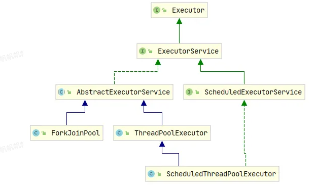

# 线程池

## 背景
实际中：线程池优化，其实在大部分公司都不需要做。因为体量不需要。

线程池是池化技术的一种实现，池化技术就是提前保存大量的资源，以免不时之需。
在机器资源有限的情况下，使用池化技术可以大大的提高资源的利用率，提升性能。

线程池，说的就是提前创建好一批线程，然后保存在线程池中，当有任务需要执行的时候，从线程池中选一个线程来执行任务，**就可以避免频繁创建和销毁线程的开销**。

我们常用到的池化技术有：线程池、连接池、内存池、对象池。

线程池相关的类的继承关系如下：

通过图可以看到，具体的实现类有 2 个，ThreadPoolExetutor 和 ForkJoinPool。
我们这篇文章主要以 ThreadPoolExetutor 展开去学习和使用。至于它们两的区别，在当前目录下的 《ThreadPoolExetutor 和 ForkJoinPool 的区别》有写到。

## 线程池的原理

### 线程池的组成元素
由三部分组成：
1、工作线程集合
2、任务队列
3、拒绝策略

在 ThreadPoolExetutor 的源码可以找到如下 3 个属性。
- workQueue：任务队列.是一个`BlockingQueue<Runnable>`，负责缓存待执行的任务。
- workers：工作线程集合，是一个`HashSet<Worker>`，负责管理所有工作线程的生命周期。
- handler：拒绝策略,是一个`RejectExecutionHandler`，用来定义如何处理无法执行的任务。

#### Worker
这里还有个 Worker 的概念很重要，Worker是实现了 `Runnable` 接口的。每个 `Worker` 对象会包含一个任务和一个线程：
- 任务（`Runnable firstTask`）：任务就是我们提交给线程池要执行的那个任务（`Runnable`类型），也就是说一个任务如果想被执行，都必须要变成一个Worker。
- 线程（`Thread thread`）：`Worker` 会有一个线程来执行它的任务。这个线程是由 `ThreadPoolExecutor` 创建并管理的。

```java
Worker(Runnable firstTask) {
    setState(-1); // inhibit interrupts until runWorker
    this.firstTask = firstTask;
    this.thread = getThreadFactory().newThread(this);
}
```

每个 `Worker` 对象都会持有一个任务（`firstTask`）。当 `Worker` 被创建时，它会通过构造函数接收一个`Runnable` 类型的任务。但是Worker并不是执行完这个任务就结束了，而是会继续从任务队列中取任务并执行，直到线程池关闭或任务队列为空。


`Worker` 中有一个 `Thread` 对象，它表示实际执行任务的工作线程。每个 `Worker` 都会拥有一个线程，线程会执行 `run()` 方法中的任务。


在 `run()` 方法中，`Worker` 反复执行 `runTask(firstTask)` 来执行任务。执行完一个任务后，`Worker`会继续检查线程池的状态（`runStateAtLeast(ctl.get(), SHUTDOWN)`）并获取新的任务，直到线程池关闭。

#### 线程池的参数
介绍下这些参数的意思。
- corePoolSize: 核心线程数量，可以类比正式员工数量，常驻线程数量。
- maximumPoolSize: 最大的线程数量，公司最多雇佣员工数量。常驻+临时线程数量。
- workQueue: 多余任务等待队列，再多的人都处理不过来了，需要等着，在这个地方等。
- keepAliveTime: 非核心线程空闲时间，就是外包人员等了多久，如果还没有活干，解雇了。
- threadFactory: 创建线程的工厂，在这个地方可以统一处理创建的线程的属性。每个公司对员工的要求不一样，恩，在这里设置员工的属性。
- handler: 线程池拒绝策略，什么意思呢？就是当任务实在是太多，人也不够，需求池也排满了，还有任务咋办？默认是不处理，抛出异常告诉任务提交者，我这忙不过来了。


### 添加一个任务的全过程
1、首先，线程池会检查当前线程池中是否有空闲线程来执行这个任务。如果当前线程池中正在运行的线程数少于核心线程数（corePoolSize），线程池会立即创建一个新线程来执行任务。通过调用 addWorker(command, true) 方法来创建新线程并执行任务。
2、如果当前线程池的工作线程数已经达到核心线程数，且所有线程都在忙碌工作，那么接下来的任务会被放入任务队列中，等待线程执行。线程池会将任务提交到队列，使用 offer() 方法将任务放入队列中
3、如果队列已经满了，且当前线程池中的线程数少于最大线程数（maximumPoolSize），线程池会尝试创建新的线程来执行任务。
4、如果线程池的线程数已经达到最大线程数（maximumPoolSize），并且任务队列也已满，那么线程池就会执行拒绝策略。

这里逻辑稍微有点复杂，画了个流程图仅供参考。


再通过这个流程，我们把线程池的 3 个关键角色串联起来：


